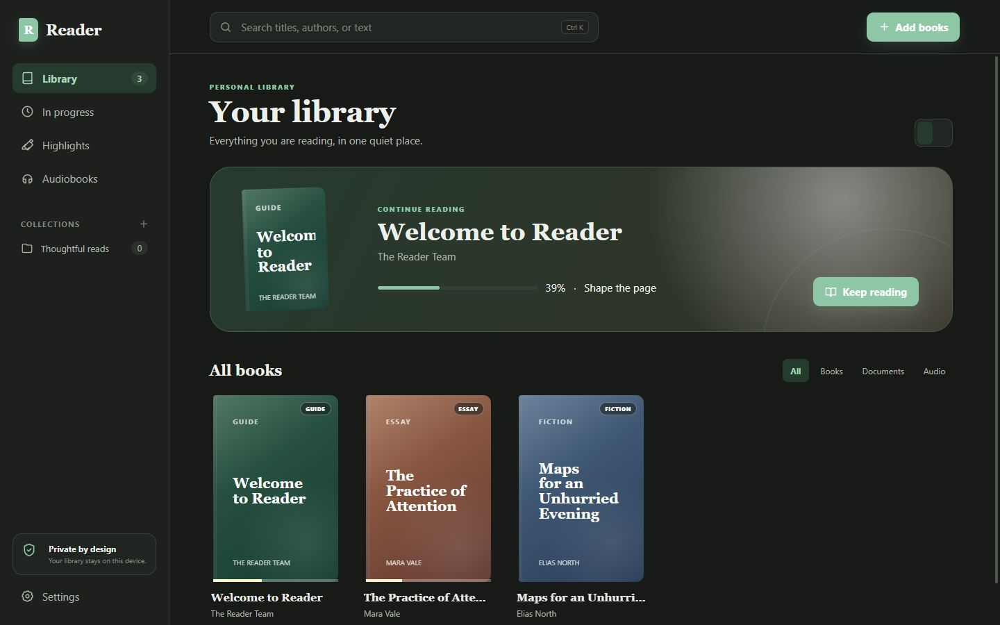
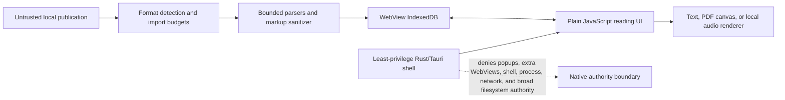

# Reader — a local-first reading library

Reader is a Windows prerelease for reading authorized EPUB, PDF, text, and audio files without an account, storefront, telemetry, or required network connection.

> **Publication status:** `0.1.0-alpha.4` is staged in a private GitHub repository and is not a public release. The source is MIT-licensed; the installer remains unsigned and has not completed the clean-Windows release matrix.



## Why Reader

Most reading software begins with a store, feed, or account. Reader begins with files the reader is authorized to use and keeps the core loop on the device: add a publication, read or listen, resume, annotate, organize, and export sensitive metadata when needed.

### Shipped in this candidate

- Bounded EPUB 2/3 imports with traversal rejection, real extracted-byte limits, sanitized content, navigation, and embedded-image budgets.
- Hardened PDF.js `6.2.108` canvas rendering with local matching worker, disabled scripting/evaluation/XFA, page navigation, zoom, cancellation, and progress.
- Sanitized TXT, Markdown, and HTML reading with search, bookmarks, highlights, and private notes.
- Unprotected M4B, M4A, MP3, AAC, OGG, and WAV playback with resume, speed, skipping, and a session sleep timer.
- Respectful AAX handling as bounded metadata only: no activation data, payload persistence, decryption, conversion, or playback.
- Local IndexedDB persistence for books, progress, annotations, collections, and settings, with deterministic stale-save protection across close, deletion, reset, and renderer destruction.
- One native Reader window and one process. Normal executable or installed-shortcut launches create no terminal; second launches focus the existing window, and native popup requests are denied.

## Architecture and trust boundary



Imported files are untrusted. The WebView receives no generic shell, process, network, or broad filesystem capability. Reader itself performs no application network requests. See [Architecture](docs/ARCHITECTURE.md) and [Security](SECURITY.md) for the exact boundaries and limitations.

## Supported formats

| Format                            | Current behavior                                             | Important limits                                                                                |
| --------------------------------- | ------------------------------------------------------------ | ----------------------------------------------------------------------------------------------- |
| EPUB                              | EPUB 2/3 reflowable reading, navigation, search, annotations | 200 MiB archive, 5,000 entries, 1,000 sections; fixed-layout and protected EPUB are unsupported |
| PDF                               | Canvas page rendering, navigation, zoom, progress            | No text layer, full-document search, PDF annotations, or accessible document text               |
| TXT / Markdown / HTML             | Normalized or sanitized reading, search, annotations         | 32 MiB text input; active and remote content removed                                            |
| M4B / M4A / MP3 / AAC / OGG / WAV | Local playback, resume, seek, speed, skip, sleep timer       | Actual codec support follows the installed Windows WebView2 media engine                        |
| AAX                               | Bounded metadata-only catalogue entry                        | No payload storage, activation request, decryption, conversion, or playback                     |

The complete machine-readable limits live in [the canonical facts ledger](docs/PROJECT_FACTS.json) and are enforced by `app/src/import-policy.js`.

## Privacy model

- Library data and imported open-content blobs stay in the local WebView profile's IndexedDB.
- No account, telemetry, advertising, cloud sync, remote font, storefront, or required API is present.
- AAX payloads are never persisted.
- JSON export contains private titles, filenames, progress, quotes, notes, collections, and settings. It is a **one-way sensitive metadata export**, not a restorable library backup.
- IndexedDB can be affected by WebView2 profile loss, operating-system storage policy, or eviction. Reader does not promise archival durability.

Use only publications you are authorized to access. Do not upload publications, protected-media information, activation data, exports, or private annotations to bug reports.

## Current technology

- Frontend: HTML, CSS, and plain JavaScript ES modules
- Persistence: IndexedDB in the Tauri WebView profile
- Desktop boundary: Rust and Tauri v2
- Rendering/parsing: vendored PDF.js, JSZip, and Marked
- Verification: Node's test runner, c8, Playwright, axe, ESLint, Stylelint, Markdownlint, Prettier, Cargo fmt/clippy/check/test, npm audit, and cargo-audit
- Windows packaging: Tauri NSIS current-user installer

Reader is not a React, TypeScript, Vite, SQLite, cloud-sync, or Rust-domain-backend application. Those technologies are not presented as shipped work.

## Verified evidence

Evidence recorded on August 17, 2026 for `0.1.0-alpha.4`:

- 40 of 40 deterministic Node unit, parser-policy, data-integrity, structure, and desktop-shell tests passed.
- Seven of seven real Chromium scenario groups passed, covering core reading, hostile inputs, IndexedDB persistence and rollback, deletion/reset races, PDF failure modes, offline behavior, keyboard operation, and responsive behavior.
- Six axe scans reported zero serious or critical findings. This is not a claim of WCAG conformance.
- High-risk import-policy and save-coordinator coverage: 99.19% lines/statements, 89.67% branches, and 100% functions.
- Both production and full JavaScript dependency audits reported no known advisories at the tested threshold.
- RustSec reported no vulnerability entries; it also reported 17 allowed cross-platform warnings. The GTK/GLib families implicated by those warnings do not resolve into the Windows target graph.
- Vendored PDF.js library and worker both identify as `6.2.108`, build `0365cbde0`, and match their recorded hashes.

The [test matrix](docs/TESTING.md) distinguishes automated evidence, local packaged-app evidence, and the clean-machine checks that remain blocked. Generated reports are excluded from source control.

## Quick start from a clean clone

Prerequisites: Node.js 20 or newer and the pinned pnpm release named in `package.json`.

```powershell
corepack enable
pnpm install --frozen-lockfile
pnpm dev
```

Open `http://127.0.0.1:4173`. This development command keeps its server in the terminal that launched it. The normal packaged Windows application does not start a terminal or local server.

Run the complete web verification:

```powershell
pnpm format:check
pnpm lint
pnpm test:unit
pnpm test:coverage
pnpm test:e2e
pnpm verify:vendor
pnpm verify:facts
pnpm verify:links
pnpm verify:private-data
pnpm generate:sbom
```

## Windows desktop build

Install the current Tauri v2 Windows prerequisites: Rust with the MSVC target, Microsoft C++ Build Tools, and WebView2. Then run:

```powershell
pnpm install --frozen-lockfile
pnpm test:rust
pnpm verify:windows-dependencies
pnpm tauri build --bundles nsis
```

The resulting local NSIS candidate is intentionally unsigned. There is no approved public download or release URL. A stable public binary release requires Authenticode signing and a clean Windows 10/11 install/upgrade/uninstall matrix.

## Known limitations

- IndexedDB, not SQLite, is the durable store; metadata export cannot restore a library.
- Canvas-only PDF pages do not expose selectable or complete screen-reader-accessible document text.
- PDF password entry, PDF annotations, full-document PDF search, fixed-layout EPUB, protected EPUB, EPUB CFI locations, background media controls, sync, and cloud backup are not implemented.
- Audio decoding varies with Windows WebView2 codecs.
- Automated axe checks do not replace assistive-technology or scoped accessibility auditing.
- The private staging candidate has not completed a clean Windows 10/11 installation, upgrade, uninstall, and residual-user-data matrix.
- The installer is unsigned; no signing certificate or signing authorization has been provided.

## Project history, support, and licensing

Development began as local work before this repository history was initialized. The initial Git commit records a sanitized import of that existing alpha work; it does not pretend to capture earlier development chronology. The owner-confirmed record is in [Project provenance](docs/PROVENANCE.md).

- Read [Support](SUPPORT.md) before sharing diagnostic information.
- Report security concerns through the private route described in [Security](SECURITY.md).
- Review [Contributing](CONTRIBUTING.md), [Roadmap](ROADMAP.md), [release process](docs/RELEASE_PROCESS.md), and [release notes](docs/RELEASE_NOTES.md).
- Vendored and build dependencies retain their upstream licenses in [third-party notices](THIRD_PARTY_NOTICES.md) and the [component manifest](THIRD_PARTY_COMPONENTS.json).

Reader is licensed under the [MIT License](LICENSE). Third-party components remain governed by their own licenses and notices.

## AI assistance and accountability

AI coding agents assisted with research, implementation, testing, and iteration. Nouraldin Farge defined the requirements and architecture, reviewed and validated changes, set the safety, licensing, and data-source boundaries, and retains responsibility for published claims and releases. Automated and AI-assisted review does not replace human release approval.
