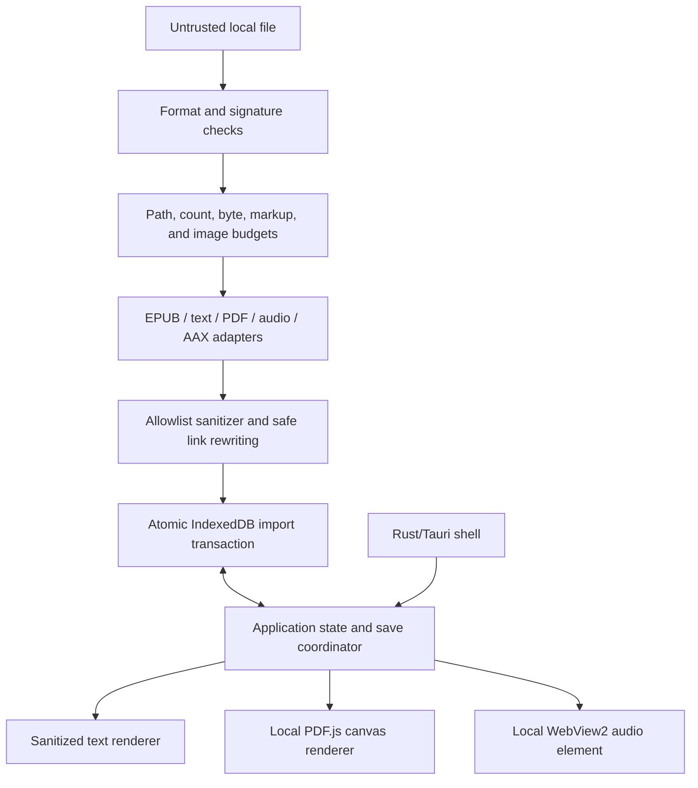

# Architecture and trust boundaries

Reader `0.1.0-alpha.4` is a dependency-light WebView application wrapped in Tauri v2. The shipped frontend is plain JavaScript, HTML, and CSS. IndexedDB is the current durable store. Rust owns only the native shell, window policy, single-instance behavior, and packaging—not the reading domain or a SQLite backend.

## Runtime view

| Module                        | Owns                                                                                               | Does not own                                                            |
| ----------------------------- | -------------------------------------------------------------------------------------------------- | ----------------------------------------------------------------------- |
| `app/src/app.js`              | Routes, UI state, import/reader orchestration, accessible interaction                              | Archive parsing or raw IndexedDB transaction mechanics                  |
| `app/src/core.js`             | Pure labels, identifiers, progress, display helpers, synthetic demo library                        | DOM or persistence                                                      |
| `app/src/import-policy.js`    | Archive paths, URL classification, extraction budgets, signatures, secure fingerprints             | UI or format-specific document structure                                |
| `app/src/parsers.js`          | Bounded parsing, sanitizer, EPUB navigation, file normalization                                    | Unsanitized rendering or native authority                               |
| `app/src/db.js`               | IndexedDB v1 schema and atomic operations                                                          | UI rendering or publication interpretation                              |
| `app/src/save-coordinator.js` | Immutable save snapshots, generations, tombstones, library epoch, flush/invalidate/error lifecycle | Database implementation details                                         |
| `app/src/renderers.js`        | Text paint, PDF session, audio session, restricted-AAX presentation                                | File authorization, DRM handling, native capabilities                   |
| `src-tauri/`                  | One-window native policy, single-instance focus, restricted navigation, packaging                  | Domain storage, arbitrary filesystem, shell, process, or network access |

## Native boundary

The Tauri configuration declares one `main` window template with automatic creation disabled. Rust creates that window exactly once so the native WebView builder can reject every popup request before application JavaScript runs. Top-level navigation is restricted to Reader's packaged origin and the exact development origin in debug builds. Frontend window/WebView creation and developer-tool toggling are explicitly denied.

On Windows, `windows_subsystem = "windows"` is unconditional, including debug builds. Directly launching the executable or an installed shortcut therefore opens the graphical Reader window without a console. The single-instance plugin is registered first; a later launch exits and restores, shows, and focuses the existing `main` window.

## Save and deletion concurrency model

Every delayed save enters one coordinator:

1. Scheduling clones an immutable book snapshot and associates it with the current per-book generation and library epoch.
2. Re-scheduling replaces the pending snapshot; in-flight writes remain serialized.
3. Closing a valid reader flushes its latest intended state before renderer teardown.
4. Deletion first tombstones the book, increments its generation, removes pending work, and drains in-flight work before the atomic database deletion completes.
5. Reset increments the library epoch and invalidates every pending/per-book generation before the atomic clear-and-reseed transaction.
6. A callback captured before invalidation fails its generation/epoch/tombstone check and cannot write.
7. `db.saveBook` independently refuses to create a missing book, providing a second storage-level guard.
8. PDF/audio renderer sessions carry their own generations and abort stale callbacks after switching, destruction, deletion, or reset.
9. Asynchronous failures are caught, reported through a non-sensitive UI message, and never left as unhandled promise rejections.

The regression suite repeatedly covers pending and in-flight delete/reset races, multiple queued updates, close/flush/reopen, renderer destruction, and error handling. Real Chromium tests reopen IndexedDB after each destructive action to verify records stay absent.

## Storage model

| Store         | Key           | Content                                                                      |
| ------------- | ------------- | ---------------------------------------------------------------------------- |
| `books`       | book ID       | normalized metadata, sanitized sections, progress, bookmarks, collection IDs |
| `blobs`       | book ID       | authorized EPUB/PDF/unprotected-audio Blob; never an AAX payload             |
| `annotations` | annotation ID | book ID, locator, quote, note, timestamp                                     |
| `collections` | collection ID | local name and timestamp                                                     |
| `settings`    | key           | library/reader theme, type, spacing, focus mode, view mode                   |

Schema version `1` uses atomic transactions for import, book/blob deletion, reset, and reseeding. Integrity inspection reports orphaned blobs or annotations. The test-only quota scenario injects a synchronous `QuotaExceededError` at `IDBObjectStore.put` and proves the transaction aborts without partial data; it is not a measurement of a physical device's quota ceiling.

IndexedDB remains acceptable for this public-source prerelease because the product makes no archival-durability claim and describes eviction/profile-loss risk. Any future SQLite migration requires a versioned restore/migration design, a narrow Rust command contract, and full packaged-app verification; it must not be done merely for presentation.

## Import trust model

- Every input is untrusted, regardless of extension or MIME.
- ZIP paths are repeatedly decoded, normalized, and rejected for absolute, external, drive-letter, UNC-like, control-byte, null-byte, or parent traversal forms.
- Actual streamed extraction bytes are metered; private JSZip metadata is not trusted as an enforcement boundary.
- EPUB package/spine/navigation references must resolve to unique valid entries inside the archive.
- Markup is parsed inertly and reduced to allowed elements and attributes. SVG, MathML, scripts, forms, embedded browsing contexts, CSS, metadata, remote resources, unsafe URL schemes, and clobbering IDs are removed.
- Images are admitted only from bounded local EPUB entries whose bytes match an allowed raster signature.
- Full/chunk file fingerprints use Web Crypto SHA-256 and include separated samples for large inputs, so name/size/timestamp collisions are insufficient.
- PDF.js receives local bytes and local worker URL with scripting, evaluation, XFA, and Wasm image codecs disabled and render dimensions capped.
- AAX parsing is bounded to structural metadata. No protected payload enters IndexedDB.

## Network and privacy boundary

The application CSP denies connections, forms, plugins, base-URI changes, and remote objects. Permitted `blob:`/`data:` use is limited to local publication media and PDF workers. The application has no Tauri network plugin, account, analytics, advertisements, remote fonts, updates, or cloud service. Automated browser tests fail on any unintended outbound request and monitor popup/page creation.

See [Security policy](../SECURITY.md), [format behavior](FORMATS.md), and the [canonical facts ledger](PROJECT_FACTS.json).
